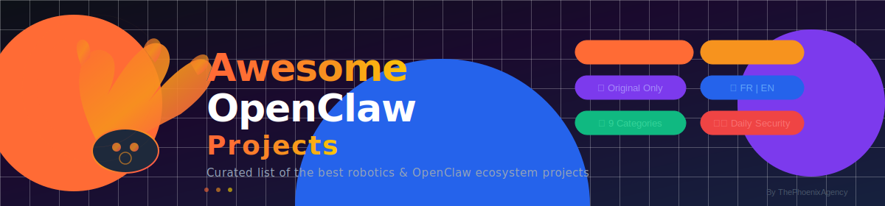

# Awesome OpenClaw Projects · Page 2

**[← Page 1](./README.md) | [🇫🇷 Français](#-version-française) | [🇬🇧 English](#-english-version)**

---

## 🇬🇧 English Version — Page 2

> Continuation of the curated OpenClaw ecosystem repositories list. Additional repositories discovered by the hourly automated scan.

## 🇫🇷 Version Française — Page 2

> Suite de la liste curatée des dépôts de l'écosystème OpenClaw. Dépôts supplémentaires découverts par le scan automatique toutes les heures.

---

## 📦 Dépôts Supplémentaires / Additional Repositories

<!-- PAGE2_REPOS START -->
| ⭐ Stars | Projet / Project | Catégorie | Description 🇫🇷 | Description 🇬🇧 | Page |
|---------|-----------------|-----------|-----------------|-----------------|------|
| — | *En attente de nouveaux repos / Waiting for new repos* | — | — | — | — |
<!-- PAGE2_REPOS END -->

---

## 📄 Navigation des Pages / Page Navigation

| Page | Contenu | Lien |
|------|---------|------|
| **Page 1** | Catégories principales (1-9) | [README.md](./README.md) |
| **Page 2** (actuelle) | Repos supplémentaires | [README-2.md](./README-2.md) |

---

## 💰 Soutenir / Support

---

**🌐 Découvrez mes autres projets / Discover my other projects**

*Services IA · NoCode · Automatisation | AI · NoCode · Automation Services*

---

*📅 Dernière mise à jour / Last updated: <!-- LAST_UPDATE -->2026-03-14<!-- /LAST_UPDATE --> · Page 2*

*Propulsé par / Powered by [GitHub Actions](https://github.com/features/actions) · [ThePhoenixAgency](http://ThePhoenixAgency.github.io)*

